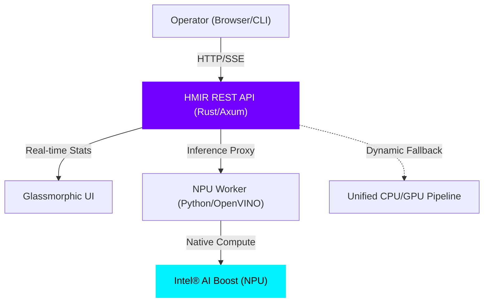

# HMIR Elite: Unified Cognitive Hardware Interface


**High-performance unified dashboard and inference engine for heterogeneous compute.**

*Orchestrate local AI across NPUs, GPUs, and CPUs with zero-latency glassmorphic monitoring.*

---

## 🚀 One-Command Install

HMIR Elite automatically handles hardware probing, driver detection, and environment synchronization.

### Windows (PowerShell)

```powershell
irm https://raw.githubusercontent.com/bhattkunalb/HMIR/main/scripts/install.ps1 | iex
```

### Linux & macOS (Bash)

```bash
curl -fsSL https://raw.githubusercontent.com/bhattkunalb/HMIR/main/scripts/install.sh | sh
```

---

## ✨ Why HMIR Elite?

- 💎 **Integrated Glassmorphic Dashboard**: Real-time telemetry for NPU, GPU, and CPU utilization alongside a premium chat interface.
- ⚡ **Intel® NPU Acceleration**: Native OpenVINO™ execution on Intel AI Boost (Meteor Lake/Core Ultra) hardware for maximum efficiency.
- 🌊 **Zero-Warning Streaming**: Robust Server-Sent Events (SSE) stability with intelligent boundary reassembly for smooth token generation.
- 🛠️ **Unified Binary Core**: A single, high-performance Rust/Axum engine managing multiple Python-based hardware microservices.
- 📦 **Portable isolation**: Fully containerized or isolated virtual environments with automated PATH and dependency management.

---

## 🏗️ Core Architecture

HMIR utilizes a hybrid architecture to bridge high-level cognitive frameworks with low-level hardware acceleration.



---

## 🖥️ Hardware Support Matrix

| Target Hardware | Compute Provider | status | Priority |
| :--- | :--- | :--- | :--- |
| **Intel® NPU (AI Boost)** | OpenVINO™ GenAI | 🟢 **STABLE** | Elite |
| **Intel® ARC™ GPU** | OpenVINO / IPEX | 🟢 **STABLE** | Native |
| **Apple Silicon (M1/M2/M3)** | CoreML / MLX | 🟢 **STABLE** | Native |
| **NVIDIA RTX™ GPU** | CUDA / TensorRT | 🟡 **BETA** | Proxy |
| **Unified CPU** | OpenVINO / ONNX | 🟢 **STABLE** | Fallback |

---

## 🛠️ Developer Quick Start

### 1. Interaction via CLI

```bash
# Probe hardware and get optimized model recommendations
hmir suggest

# Start the unified dashboard and inference node
hmir start --dashboard
```

### 2. REST API Integration

HMIR exposes an OpenAI-compatible endpoint at `localhost:8080/v1/chat/completions`.

```bash
curl http://localhost:8080/v1/chat/completions \
  -H "Content-Type: application/json" \
  -d '{
    "messages": [{"role": "user", "content": "Analyze hardware status."}],
    "stream": true
  }'
```

### 3. Local Development (Source Build)

If you are contributing to the core, install from your local clone:

```powershell
.\scripts\install.ps1 -Local
```

---

## 📂 Repository Structure

- 🦀 `hmir-api`: High-performance Rust server orchestrating inference and telemetry.
- 📦 `hmir-core`: Shared hardware abstractions and cognitive utility substrate.
- 🐍 `scripts`: NPU Service logic and cross-platform installation bridges.
- 🐳 `deploy`: Multi-stage Docker templates for production distribution.

---

## 🤝 Contributing

We welcome Elite developers to harden the HMIR core. Please see our [CONTRIBUTING.md](file:///c:/Users/silve/OneDrive/Desktop/HMIR/CONTRIBUTING.md) for architectural guidelines and submission standards.

---

**HMIR Elite** • Built with ❤️ for the future of local heterogenous compute.
